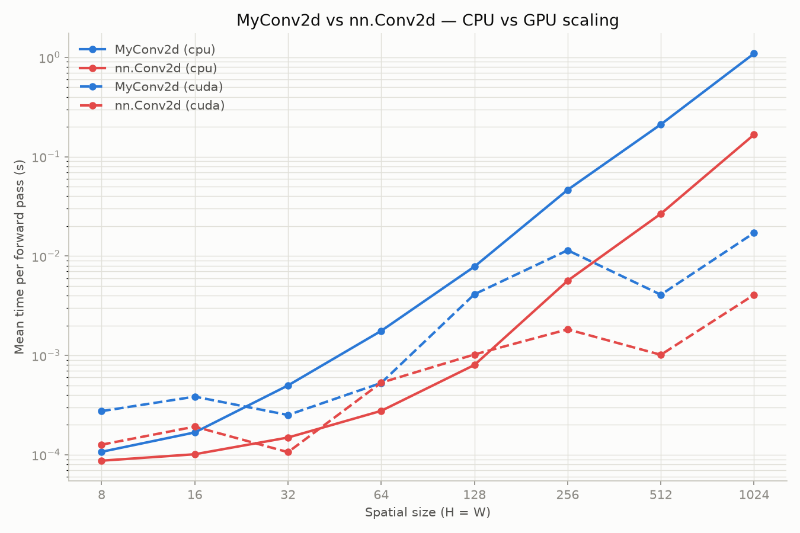

# Custom Conv2D from scratch

A from-scratch reimplementation of `nn.Conv2d`, built to understand what a
convolution layer actually computes rather than treating it as a black box.
Verified for correctness against PyTorch's built-in layer, then benchmarked
across problem sizes and devices to see where the naive implementation holds
up and where it doesn't.

## Files

| File | Purpose |
|---|---|
| `my_conv2d.py` | `MyConv2d` — the custom layer (im2col + matmul) |
| `test_my_conv2d.py` | pytest suite: output shape, correctness, gradient flow |
| `benchmark_my_conv2d.py` | Times `MyConv2d` vs `nn.Conv2d` on CPU/GPU across sizes, writes results to `results/` |
| `plot_benchmark.py` | Plots the latest results CSV |
| `cnn_cifar10.py` | CIFAR-10 CNN training script — **in progress**, not yet wired up to `MyConv2d` |

## How `MyConv2d` works

Rather than sliding a kernel with nested loops, it uses the **im2col** trick:

1. `F.unfold` extracts every `kernel_size × kernel_size × in_channels` patch the
   convolution would slide over and flattens each into a vector, stacking them
   into a matrix.
2. The layer's weights are reshaped from `(out_channels, in_channels, kH, kW)`
   into a 2D matrix.
3. One `matmul` between the two replaces the entire sliding-window computation.
4. The result is reshaped back into `(N, out_channels, H_out, W_out)`.

This is the same trick real conv implementations use to avoid a Python-level
loop over every output position — the loop becomes one (vectorized) matrix
multiply instead.

## Running the tests

```
pytest test_my_conv2d.py -v
```

Covers: output shape matches `nn.Conv2d` across padding/stride, numerical
output matches `nn.Conv2d` (`torch.allclose`) when both are given identical
weights, and gradients flow through to `weight`/`bias` without `NaN`s.

## Running the benchmark

```
python benchmark_my_conv2d.py   # sweeps sizes 8..1024 on cpu (+ cuda if available), writes results/benchmark_<timestamp>.csv
python plot_benchmark.py        # plots the most recent results CSV
```

## Findings

**Correctness:** `MyConv2d` matches `nn.Conv2d`'s output exactly (within
floating-point tolerance) and gradients flow correctly — the im2col+matmul
approach is mathematically sound, not just "close enough."

**Speed, CPU** (mean forward-pass time; `in_channels=3, out_channels=32,
kernel_size=3, padding=1, stride=1, batch=2`):

| size (H=W) | MyConv2d | nn.Conv2d | ratio |
|---|---|---|---|
| 8 | 0.11 ms | 0.09 ms | 1.2x |
| 32 | 0.50 ms | 0.15 ms | 3.4x |
| 128 | 7.83 ms | 0.80 ms | 9.8x |
| 256 | 46.4 ms | 5.6 ms | 8.2x |
| 1024 | 1092 ms | 167 ms | 6.6x |

The slowdown isn't constant — it grows through small/mid sizes (peaking
around size 128) before easing slightly at the largest sizes. This tracks
with expectations: `MyConv2d` explicitly materializes the full unfolded-patches
tensor in memory (size grows with `C·k²·H·W`), something cuDNN's direct
convolution avoids — so the gap is driven by memory overhead, not just raw
FLOPs.

**Speed, GPU:** at small sizes (8–64), `MyConv2d`'s GPU time is nearly flat
(~0.25–0.5 ms) — dominated by fixed kernel-launch overhead rather than actual
compute, since there isn't enough work yet to amortize it. The gap to
`nn.Conv2d` only opens up meaningfully from size 128 onward. Note: timings at
256/512 are non-monotonic (256 measured slower than 512 for both
implementations) — most likely benchmark noise from no warmup pass and/or
cuDNN's autotuner picking different algorithms per shape, not a real
reversal in the trend. Worth re-measuring with repeated trials
(`blocked_autorange()`) before trusting that specific data point.

**CPU vs GPU crossover (for `MyConv2d` itself):** CPU is faster at sizes 8
and 16; GPU pulls ahead from size 32 onward, and the gap widens fast (by
size 1024, GPU is ~60x faster than CPU for the same implementation). Moving
small tensors to GPU isn't worth it here — the crossover point is where the
actual compute starts to outweigh transfer/launch overhead.



## Follow-ups

- Wire `MyConv2d` into `cnn_cifar10.py` in place of `nn.Conv2d` and confirm a
  real training run still works end-to-end (isolated unit tests passing
  doesn't guarantee integration behaves the same way).
- Re-run the GPU sweep with more repeats to confirm/explain the 256↔512
  non-monotonicity noted above.
