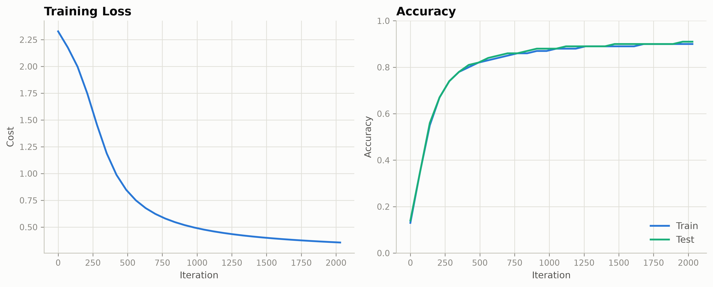

# MNIST digit classifier — a neural network from scratch in NumPy

A fully-connected neural network for MNIST digit classification, built without any deep learning framework — forward propagation, backpropagation, and gradient descent are all implemented by hand in NumPy. Keras is used only to load the MNIST dataset and one-hot encode the labels; no framework does the actual learning.

## Architecture

- Input: 784 (28×28 flattened, pixel values normalized to [0, 1])
- Hidden layers: 100 → 200 units, ReLU
- Output: 10 units, softmax
- Loss: categorical cross-entropy
- Optimizer: plain gradient descent (no momentum/Adam)

## Bugs found while building this

Writing backprop by hand surfaces bugs a framework would normally hide:

- **Stale gradients in the update step.** `update_parameters`'s parameter was named `grad`, but the function body referenced a variable called `grads` — which didn't exist locally, so Python silently fell back to a leftover global variable computed once, before training even started. Every iteration was updating weights with the same one-time gradient instead of the freshly computed one. Nothing crashed; the model just couldn't learn.
- **Softmax overflow.** `np.exp(Z)` on raw (unnormalized) logits overflowed to `inf`, and `inf / inf` produced `nan`. Fixed by subtracting the max before exponentiating (the standard numerically-stable softmax) and normalizing pixel inputs to `[0, 1]`.
- **Shape mismatch between labels and network output.** The one-hot labels came out as `(examples, classes)` from `to_categorical`, but the network's output layer is `(classes, examples)` — numpy correctly refused to broadcast these together and raised an error, which is what caught it.

## Results



Metrics per iteration are logged in [`training_history.json`](training_history.json).

## Running it

```bash
python numpy_ann_mnist.py
```

Produces (in the working directory):
- `training_curve.png` — loss and train/test accuracy over training
- `training_history.json` — the raw per-checkpoint metrics
- `mnist_ann_parameters.npz` — trained weights/biases (not committed to this repo — regenerate by running the script)
