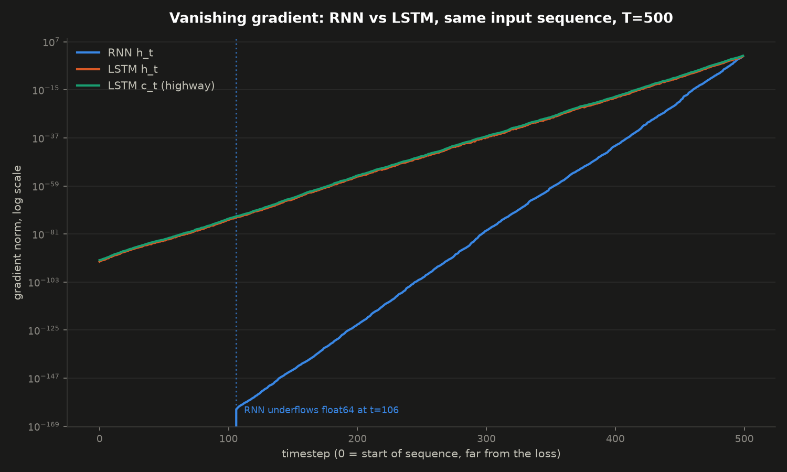

# Hand-Rolled RNN & LSTM Cells (Phase 1)

Hand-written forward pass for a vanilla RNN cell and an LSTM cell, using raw
tensor ops only (no `nn.RNNCell` / `nn.LSTMCell` in the implementation),
validated against PyTorch's built-ins, plus a from-scratch empirical
investigation of the vanishing gradient problem.

## Files

- **`hand_rnn.py`** — `HandRNNCell`. `forward(x_t, h_prev) -> h_t`.
  `h_t = tanh(x_t @ Wxh.T + h_prev @ Whh.T + bh)`.
- **`hand_lstm.py`** — `HandLSTMCell`. `forward(x_t, h_prev, c_prev) -> (h_t, c_t)`.
  Four gates (forget, input, candidate, output); `C_t` is a pure additive/gated
  update (`f_t * C_prev + i_t * g_t`), never rewritten through a matmul+tanh
  the way `h_t` is.
- **`gradient_comparison.py`** — imports both cells, runs a controlled
  side-by-side gradient decay comparison, saves a plot to `results/`.
- **`results/vanishing_gradient_rnn_vs_lstm.png`** — the output of the above.

Both `hand_rnn.py` and `hand_lstm.py` gate their validation/test code behind
`if __name__ == "__main__":`, so the classes can be imported elsewhere
(Phase 2, Phase 3, `gradient_comparison.py`) without triggering it.

## Validation

Both cells' weights are copied from a freshly-constructed `nn.RNNCell` /
`nn.LSTMCell` (matching shapes, `weight_ih`/`weight_hh`/`bias_ih`/`bias_hh`)
and their forward outputs compared with `torch.allclose`. Both match to
`atol=1e-6`.

**Two bugs worth remembering**, both hit and fixed during this phase:

1. **Elementwise vs. matmul.** `C_t = f_t * C_prev + i_t * g_t` and
   `h_t = o_t * tanh(C_t)` are elementwise (`*`), not `@`. Both operands are
   already the same shape (`B, H`) — nothing left to project, so `@` is
   always wrong there. Using `@` by mistake doesn't always error (it can
   silently produce garbage if the batch/hidden dims happen to line up).
2. **Gate order.** PyTorch's `nn.LSTMCell` packs `weight_ih`/`weight_hh` in
   gate order `i, f, g, o` — not the order you'd naturally name them in.
   Slicing with hardcoded indices (`[:4]`, `[4:8]`...) instead of expressions
   in `hidden_dim` also passes validation by coincidence at one specific
   `hidden_dim` and breaks the moment it changes.

## Vanishing gradient investigation

Forward activations alone don't reveal vanishing/exploding gradients —
`h_t` in the RNN is squashed by `tanh` every step, so it's bounded to
`(-1, 1)` no matter how many steps you unroll or how large the weights are.
The actual phenomenon only shows up in the **backward pass**.

Method: unroll each cell over many synthetic timesteps, `retain_grad()`
on every intermediate hidden/cell state (autograd only keeps `.grad` for
leaf tensors by default), take a single scalar loss from the *final*
timestep, call `.backward()` once, then compare `.grad.norm()` at
different depths.

`gradient_comparison.py` runs both cells on the **same input sequence**
(same `B`, `D`, `H`, same random draws), zero-initialized states, so
architecture is the only variable. First pass used float32 and showed a
hard cliff between "underflowed to exact 0.0" and "representable" — that
turned out to be a float32 precision artifact (values below ~1e-38 round
to exact zero), not the real shape of the decay. Recomputing in **float64**
removed the artifact and revealed the true smooth exponential decay curve.

**Result:** the vanilla RNN's gradient underflows even float64
(~1e-308) within a fraction of the 500-step sequence. The LSTM's gradient
— both `h_t` and `c_t` — never underflows across the full sequence,
tracking almost identically to each other the whole way. Direct empirical
confirmation of the theory: `C_t`'s backward path is a plain elementwise
scale by `f_t` at each step, not a matrix multiply through a squashing
derivative, so it doesn't compound toward zero the way the RNN's does.



## Running

```
python hand_rnn.py              # validation + gradient rollout for the RNN cell
python hand_lstm.py             # validation + gradient rollout for the LSTM cell
python gradient_comparison.py   # controlled RNN-vs-LSTM comparison + plot
```

`gradient_comparison.py` needs `matplotlib` and sets
`KMP_DUPLICATE_LIB_OK=TRUE` to work around a common Windows OpenMP DLL
conflict between PyTorch and matplotlib.
