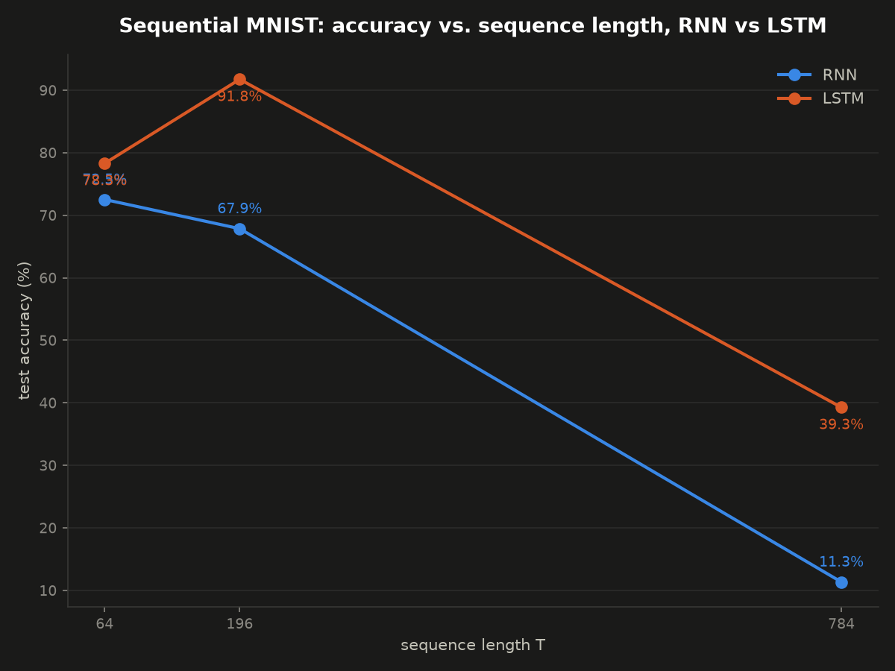
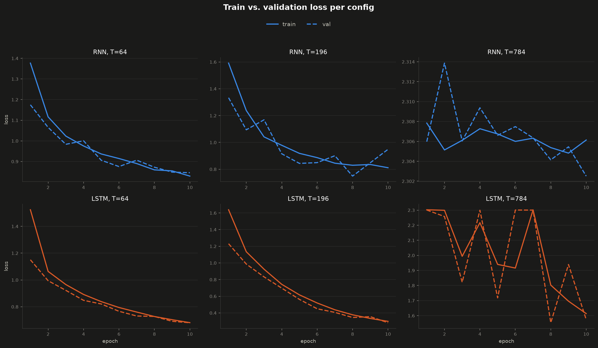

# Sequential MNIST: RNN vs LSTM (Phase 2)

Classify MNIST digits fed one pixel at a time, at three sequence lengths, using the
hand-rolled `HandRNNCell`/`HandLSTMCell` from Phase 1 — the controlled experiment that
turns Phase 1's synthetic gradient-decay measurement into a real, measurable accuracy
consequence.

## Files

- **`data.py`** — MNIST loading + the transform that turns each image into a flat pixel
  sequence at three lengths: `T=64` (8x8 center crop), `T=196` (14x14 crop), `T=784`
  (full 28x28). `build_dataloader(...)` returns train/val/test `DataLoader`s for all
  three.
- **`model.py`** — `SequentialMNISTRNN` / `SequentialMNISTLSTM`, thin wrappers that loop
  the Phase 1 cells over a sequence and classify from the *final* hidden state only via a
  single `nn.Linear` head. Imports the cells directly from
  `../handrolled_rnn_lstm/hand_rnn.py` / `hand_lstm.py`.
- **`train.py`** — `train_one_epoch`, `evaluate`, `train` — the actual training loop
  (Adam, gradient clipping) and evaluation, device-aware (`cuda` if available, else
  `cpu`).
- **`run_experiments.py`** — runs all 6 configs (`{RNN, LSTM} x {64, 196, 784}`) with
  every hyperparameter held identical except architecture and sequence length, and saves
  results to `results/experiment_results.json`. No plotting — training is the expensive
  part, decoupled from visualization on purpose.
- **`visualize_results.py`** — reads the saved JSON and produces both plots. Can be
  re-run freely to iterate on the charts without retraining anything.
- **`benchmark_speedup.py`** — one-off benchmark of a training-speed optimization (see
  below). Not part of the regular pipeline, kept for reference.
- **`results/`** — `experiment_results.json` (raw numbers + full per-epoch history for
  all 6 runs), `accuracy_vs_T.png`, `train_val_curves.png`, `writeup.md` (full analysis).

## A real bug worth knowing about

`HandRNNCell`/`HandLSTMCell`'s weights were initialized with plain `torch.randn(...)` —
harmless in Phase 1 at `hidden_dim=4-7` (used only for validating against PyTorch's
built-ins), but at the `hidden_dim=64` this phase needs, it saturated `tanh` almost
immediately (pre-activation variance scales with `hidden_dim`), killing gradient flow
before sequence length ever became the issue. Fixed with Xavier-uniform init and
zero-initialized biases in both Phase 1 cell files. See `results/writeup.md` for how this
was diagnosed.

## A training-speed optimization (post-writeup)

`HandRNNCell`/`HandLSTMCell` gained a second interface: `project_input(x)` +
`step(...)`, alongside the original `forward(x_t, h_prev, ...)` (kept untouched as
the validated reference — see each file's `__main__` block for an `allclose` check
between both paths). The idea: `x_t @ Wxh.T` doesn't depend on `h_prev`, so it can
be computed for the *entire* sequence in one batched matmul before the timestep
loop, instead of once per step inside it. Only the genuinely recurrent term
(`Whh @ h_prev`) has to stay in the loop. `model.py`'s `forward()` methods use this
path now.

Benchmarked in `benchmark_speedup.py` (RNN, `T=196`, 5 epochs): **~1.1-1.3x**
faster — real, but modest, since the unavoidable recurrent matmul and the Python
loop's own per-iteration overhead dominate more than the single matmul removed.
`torch.compile` was also tried as a bigger potential win (it fuses ops via a
graph compiler, directly targeting the same kernel-launch-count bottleneck) but
failed outright: no working Triton install on Windows, which the default backend
requires. Not pursued further — getting Triton working on Windows is a
disproportionate side-quest for the likely payoff.

## Results

| Architecture | T   | Test Accuracy | Test Loss |
|---|---|---|---|
| RNN  | 64  | 72.53% | 0.805 |
| RNN  | 196 | 67.86% | 0.903 |
| RNN  | 784 | **11.35%** | 2.303 |
| LSTM | 64  | 78.30% | 0.650 |
| LSTM | 196 | **91.75%** | 0.269 |
| LSTM | 784 | 39.28% | 1.578 |

(`H=64`, Adam `lr=1e-3`, `batch_size=64`, grad clip norm `5.0`, `epochs=10`, all
identical across every run.)





## Key finding

RNN accuracy collapses to `11.35%` at `T=784` — indistinguishable from random guessing
over 10 classes, and unchanged by doubling the epoch count, confirming this is a real
wall rather than under-training. LSTM degrades too, but nowhere near as catastrophically
(`39.28%`), consistent with Phase 1's direct measurement that its gradient survives
hundreds of orders of magnitude longer than the vanilla RNN's. Full analysis, including
the LSTM T=784 training instability and an honest note on a crop-size/sequence-length
confound at the low end, in `results/writeup.md`.

## Running

```
python run_experiments.py     # trains all 6 configs (slow, especially T=784), saves results/experiment_results.json
python visualize_results.py   # plots from the saved JSON -- no retraining needed
```

Both scripts set `KMP_DUPLICATE_LIB_OK=TRUE` to work around a common Windows OpenMP DLL
conflict between PyTorch and matplotlib. `run_experiments.py` auto-selects `cuda` if
available, otherwise `cpu`.
