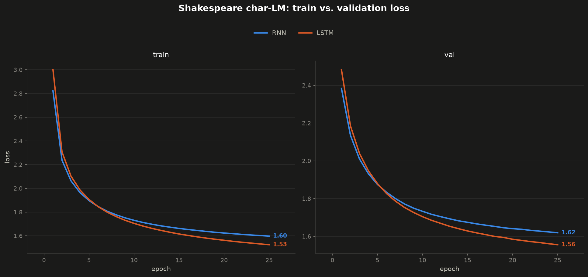
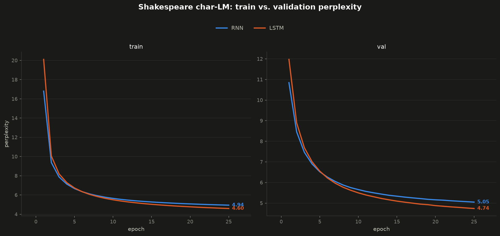

# Char-level Shakespeare: RNN vs LSTM (Phase 3)

A character-level language model trained on `tiny_shakespeare`, using the
same hand-rolled `HandRNNCell`/`HandLSTMCell` from Phase 1 — many-to-many
this time (predict the next character at *every* position, not just from a
final hidden state), the natural next step after Phase 1's synthetic
gradient measurement and Phase 2's Sequential MNIST accuracy consequence.

## Files

- **`shakespeare_data.py`** — downloads/caches `tiny_shakespeare.txt`,
  builds the character vocabulary (`char2idx`/`idx2char`), and chunks the
  encoded text into fixed-length `(input, target)` pairs for truncated BPTT.
  `build_dataloader(...)` returns train/val/test `DataLoader`s plus
  `vocab_size` and the vocab mappings.
- **`model.py`** — `CharRNN`/`CharLSTM`: `nn.Embedding` → the Phase 1 cells
  (via their optimized `project_input`/`step` interface) looped over the
  sequence, collecting a hidden state at *every* timestep → one `nn.Linear`
  classifier applied to all of them at once → `(B, T, vocab_size)` logits.
- **`train.py`** — `train_one_apoch`, `evaluate`, `train` — the training
  loop, cross-entropy loss over every `(batch, timestep)` position at once,
  perplexity as the tracked metric, and best-validation-loss checkpointing
  (`save_checkpoint`, saved to `checkpoints/`, named after the model class).
- **`run_experiments.py`** — trains both RNN and LSTM under identical
  hyperparameters, saves results to `results/experiment_results.json`.
- **`visualize_results.py`** — reads that JSON, plots train-vs-val loss and
  perplexity curves (RNN vs LSTM, side by side train/val panels).
- **`generate.py`** — loads a saved checkpoint and autoregressively samples
  text, one character at a time, threading hidden state manually across
  steps (the model's own `forward()` resets state per call, by design, so
  generation drives the cells directly).
- **`results/`** — `experiment_results.json`, `loss_curves.png`,
  `perplexity_curves.png`, `writeup.md` (full analysis).
- **`checkpoints/`** — best-validation-loss model checkpoints
  (`charrnn.pt`/`charlstm.pt`), each bundling weights + hyperparameters +
  vocab mappings needed to reload and generate without retraining.

## Results

| Architecture | Test Loss | Test Perplexity |
|---|---|---|
| RNN  | 1.6167 | 5.04 |
| LSTM | 1.5522 | **4.72** |

(`H=128`, `embed_dim=32`, Adam `lr=1e-3`, `batch_size=64`, grad clip norm
`5.0`, `seq_len=100`, `epochs=25`, identical across both runs.)





## Key finding

LSTM beats RNN by a real, direction-stable margin (~6.2% lower perplexity)
that held and slightly widened between a 15-epoch and 25-epoch checkpoint —
ruling out under-training as the explanation. But the gap is modest, nowhere
near Phase 2's `T=784` RNN collapse, which is the expected contrast:
`seq_len=100` non-overlapping chunks don't demand anywhere near the
effective memory depth Phase 2 deliberately pushed for. Both models
generate recognizably Shakespeare-flavored (if not grammatically coherent)
text, and both independently learned the play's `CHARACTER NAME:` dialogue
header structure. Full analysis, including the generated text samples, in
`results/writeup.md`.

## Running

```
python run_experiments.py     # trains both RNN and LSTM, saves results/experiment_results.json + checkpoints/
python visualize_results.py   # plots from the saved JSON -- no retraining needed
python generate.py            # loads checkpoints/, samples text from both models
```

`run_experiments.py`/`visualize_results.py` set `KMP_DUPLICATE_LIB_OK=TRUE`
to work around a Windows OpenMP DLL conflict between PyTorch and matplotlib.
All scripts auto-select `cuda` if available, otherwise `cpu`.
